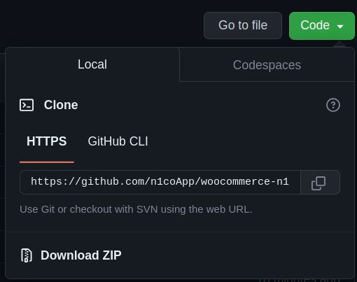

=== Payment Gateway for n1co on WooCommerce===
Contributors: recurrente,felipe
Requires at least: 5.0
Tested up to: 5.0.1
Requires PHP: 5.2.4
Stable tag: 1.0.0
License: GPLv3 or later
License URI: http://www.gnu.org/licenses/gpl-3.0.html

== Description ==

:es: Integra el pago por medio de la plataforma de n1co, acepta pagos con tarjeta Visa, Mastercard, American Express,
transferencia bancaria y cobros recurrentes

:us: Integrates payment through the n1co platform, accepts payments with Visa, Mastercard, American Express,
bank transfer and recurring charges

== Download file ==
1.  Click the Code button/ Download ZIP

== Installation ==

:us: 
1. Have WooCommerce installed.
2. install this plugin, or add it by pressing the button that says, "Upload plugin".
3. Activate the plugin through the 'Plugins' screen in WordPress
4. Use the Woocommerce->settings->payment" screen to configure the plugin
5. When buying the Plugin, they sent a password to the registered purchase email.
6. Agree your credentials in the fields intended for each of them.

:es:
1. Tener WooCommerce instalado.
2. Instale este complemento o agréguelo presionando el botón que dice "Cargar complemento".
3. Active el complemento a través de la pantalla 'Complementos' en WordPress
4. Use la pantalla Woocommerce->configuración->pago" para configurar el complemento
5. Al comprar el Plugin, enviaron una contraseña al correo electrónico de compra registrado.
6. Acuerda tus credenciales en los campos destinados a cada una de ellas.

== Changelog ==
= v1.0.00 =
* Versión inicial 2023
